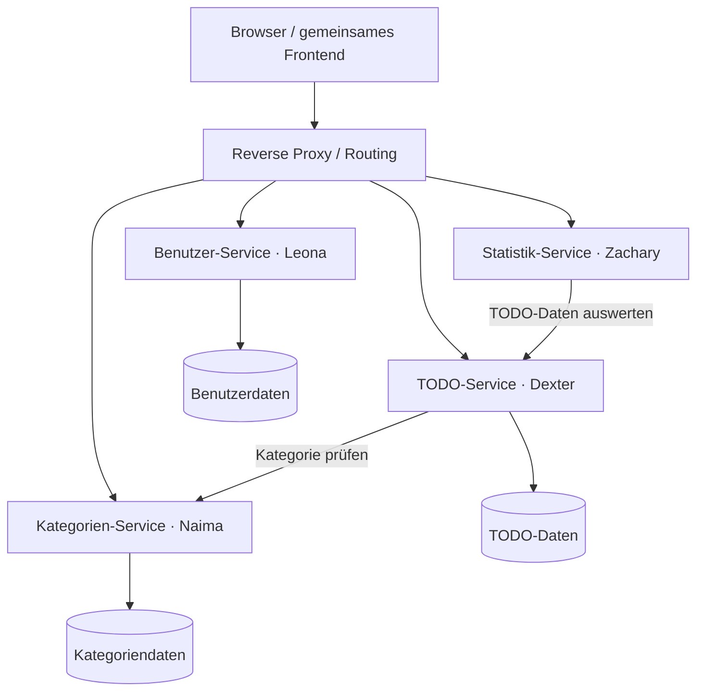

# Projektplanung – Verteilte TODO-Applikation

## 1. Beschreibung des verteilten Systems

Wir möchten eine verteilte TODO-Applikation entwickeln. Die Anwendung soll es Benutzern ermöglichen, persönlichen Aufgaben zu erstellen, zu organisieren und deren Erledigung zu verwalten.

Das System wird in mehrere voneinander getrennte Systemkomponenten aufgeteilt. Jede Komponente übernimmt einen bestimmten Aufgabenbereich und wird von einem Gruppenmitglied entwickelt. Die einzelnen Komponenten kommunizieren über gemeinsam definierte Schnittstellen und können unabhängig voneinander entwickelt und betrieben werden.

Zusätzlich entwickeln wir ein gemeinsames Frontend. Damit können Benutzer die Anwendung im Browser bedienen: sich anmelden, Aufgaben und Kategorien verwalten sowie ihre Statistiken ansehen. Das Frontend verwendet die APIs der vier Backend-Services und greift nicht direkt auf deren Datenbanken zu.

Unser erstes Ziel ist ein vollständiger, funktionierender Ablauf von der Registrierung bis zur Auswertung erledigter TODOs. Zusatzfeatures setzen wir anschliessend nach Priorität und verfügbarer Zeit um.

## 2. Aufgaben und Anforderungen des Systems

### 2.1 Pflichtfunktionen

| ID | Anforderung | Überprüfung |
|---|---|---|
| F01 | Benutzer können erstellt, bearbeitet und gelöscht werden. | Registrierung, Änderung und Löschung eines eigenen Testkontos funktionieren nach der vereinbarten Löschregel. |
| F02 | Benutzer können sich anmelden und abmelden. | Geschützte Funktionen sind nur mit gültiger Anmeldung nutzbar. Nach dem Abmelden entfernt das Frontend die Anmeldung. |
| F03 | Benutzer können eigene TODOs erstellen, anzeigen, bearbeiten und löschen. | Der gesamte CRUD-Ablauf funktioniert über das Frontend. |
| F04 | TODOs können als offen, in bearbeitung oder erledigt markiert werden. | Statuswechsel und erneutes Öffnen werden gespeichert. |
| F05 | Benutzer können eigene Kategorien erstellen, bearbeiten und löschen. | Die Kategorienverwaltung funktioniert über das Frontend. |
| F06 | TODOs können einer Kategorie zugeordnet werden. | Eine eigene aktive Kategorie ist auswählbar; ein TODO darf auch ohne Kategorie bestehen. Für die erste Version gilt höchstens eine Kategorie pro TODO. |
| F07 | Das System zeigt die Anzahl offener und erledigter TODOs an. | Die angezeigten Zahlen stimmen mit definierten Testdaten überein. |
| F08 | Das System berechnet die durchschnittliche Zeit zwischen Erstellung und Erledigung. | Die Berechnung stimmt für bekannte Zeitwerte; bei fehlenden erledigten TODOs erscheint «Keine Daten». |
| F09 | Eine gemeinsame Weboberfläche verbindet alle vier Komponenten. | Anmeldung, Kategorieerstellung, TODO-Erstellung, Erledigung und Statistik funktionieren als zusammenhängender Ablauf. |
| F10 | Fehler und Ladezustände sind für Benutzer verständlich. | Ungültige Eingaben, fehlende Anmeldung und nicht erreichbare Services führen zu verständlichen Meldungen. |

### 2.2 Nicht-funktionale Anforderungen

| ID | Anforderung | Überprüfung |
|---|---|---|
| N01 | Die vier Backend-Komponenten sind getrennt startbar und besitzen dokumentierte APIs. | Jeder Service lässt sich einzeln starten und über seine API ansprechen. |
| N02 | Benutzer können ausschliesslich auf ihre eigenen Daten zugreifen. | Zugriffe auf fremde TODOs und Kategorien werden serverseitig abgelehnt. |
| N03 | Passwörter werden nicht im Klartext gespeichert; Zugangsdaten gehören nicht ins Repository. | Datenhaltung und Konfiguration werden gemeinsam geprüft. |
| N04 | Gespeicherte Daten bleiben nach einem Service-Neustart erhalten. | Neustart mit anschliessender Datenprüfung. |
| N05 | Die Komponenten laufen auf LernMAAS oder einer mit der Lehrperson vereinbarten Alternative. | Installation und Start sind auf der Zielumgebung nachvollziehbar. |
| N06 | Zwei vereinbarte Massnahmen zur Erhöhung der Verfügbarkeit werden umgesetzt. | Dokumentierte Ausfalltests zeigen das tatsächliche Verhalten. |
| N07 | Die Oberfläche ist einheitlich und auf Desktop sowie schmalem Bildschirm bedienbar. | Hauptabläufe werden in beiden Ansichten geprüft. |
| N08 | Installation, Konfiguration, Schnittstellen und Tests sind dokumentiert. | Ein anderes Teammitglied kann die Anleitung nachvollziehen. |

### 2.3 Optionale Zusatzfeatures

Die folgenden Funktionen gehören nicht zum Mindestumfang. Wir beginnen damit erst, wenn die Pflichtfunktionen integriert sind und ausreichend Zeit für HA, Tests und Dokumentation bleibt.

| Reihenfolge | Feature | Nutzen | Betroffene Bereiche / Zusatzaufwand |
|---|---|---|---|
| 1 | Filter nach Status und Kategorie | Aufgaben schneller finden | TODO-API und TODO-Ansicht; bei Pagination serverseitig berücksichtigen |
| 2 | Suche nach TODO-Titel | Einzelne Aufgaben finden | TODO-API und Suchfeld |
| 3 | Prioritäten: niedrig, mittel, hoch | Wichtige Aufgaben hervorheben | TODO-Datenmodell, API, Formular und Darstellung |

E-Mail-Erinnerungen, Teamfreigaben, Echtzeit-Synchronisation und wiederkehrende Aufgaben sind für diese Projektversion nicht vorgesehen, weil sie zusätzliche Abläufe und Abhängigkeiten erfordern.

## 3. Aufteilung in Systemkomponenten

Die bestehende Verantwortung für die vier Backend-Komponenten bleibt erhalten. Jede Person ist für Implementierung, Integration, Tests und Dokumentation ihrer Komponente zuständig.

| Systemkomponente | Aufgaben | Zuständig |
|---|---|---|
| Benutzerverwaltung | Benutzer erstellen, bearbeiten und löschen; Anmeldung und Identitätsprüfung | Leona |
| TODO-Verwaltung | TODOs erstellen, anzeigen, bearbeiten, löschen und als erledigt markieren; Kategoriezuordnung speichern | Dexter |
| Kategorienverwaltung | Kategorien erstellen, bearbeiten und löschen; Kategorien über die API für die TODO-Verwaltung bereitstellen | Naima |
| Statistik | TODO-Daten auswerten; offene/erledigte TODOs und durchschnittliche Erledigungsdauer berechnen | Zachary |
| Gemeinsames Frontend | Benutzeroberfläche zur Bedienung aller vier Services |  |

Das Frontend ergänzt die vier individuell verantworteten Services. Es ersetzt keine der vier Backend-Komponenten.

## 4. Bestehende Software

Wir verwenden keine bestehende Applikation als Basis, sondern entwickeln die Anwendung selbst. Daher gibt es keine bestehende Applikation, die als ZIP-Datei abgegeben werden muss.

## 5. Architektur und Schnittstellen

### 5.1 Geplanter Aufbau

Das Diagramm beschreibt logische Zuständigkeiten. Die konkrete Verteilung auf VMs, Datenbanken und zusätzliche Service-Instanzen planen wir beim technischen Aufbau. Jeder Service verwaltet ausschliesslich seine eigenen Daten; Zugriffe auf andere Komponenten erfolgen über APIs.

### 5.2 Gemeinsam zu definierende Verträge

Als Ausgangspunkt planen wir HTTP-APIs mit JSON. Vor der Implementierung dokumentieren wir in `docs/schnittstellen.md`:

- Methoden und Endpunkte, Eingaben, Datentypen, Pflichtfelder und Beispielantworten.
- Authentifizierungsverfahren, Identität des Benutzers und serverseitige Zugriffsprüfung.
- Einheitliche Fehlerantworten und HTTP-Statuscodes.
- ID-Format, Zeitformat und Statuswerte.
- Verhalten bei gelöschten Daten und beim Ausfall anderer Services.
- Konfigurierbare Service-Adressen, Timeouts und Health-Endpunkte.

| Schnittstelle | Vereinbarung zwischen |
|---|---|
| Anmeldung und Benutzeridentität | Leona und allen anderen |
| Kategorien auswählen und bei einer Zuordnung prüfen | Naima und Dexter |
| TODO-Daten für die Statistik abrufen | Dexter und Zachary |
| APIs aus der Oberfläche aufrufen | Jeweilige Service-Verantwortliche und Frontend-Team |

Die Benutzer-ID wird aus der geprüften Anmeldung ermittelt. Eine beliebige Benutzer-ID aus einem Request darf keine Berechtigung auf fremde Daten geben.

### 5.3 Fachliche Regeln vor der Umsetzung

Diese Punkte müssen wir gemeinsam festlegen:

1. **Kategoriezuordnung:** Dexter speichert die `categoryId` beim TODO. Naima stellt Kategorien bereit und prüft deren Zugehörigkeit. Es gibt keine zweite Zuordnungsliste im Kategorien-Service.
2. **Kategorie löschen:** Bestehende TODOs bleiben erhalten. Wir entscheiden, ob die Kategorie logisch gelöscht und als gelöscht angezeigt wird oder ob Zuordnungen kontrolliert entfernt werden. Neue Zuordnungen zu gelöschten Kategorien sind nicht erlaubt.
3. **Konto löschen:** Wir definieren, wie zugehörige TODOs und Kategorien behandelt werden und wie der weitere Zugriff verhindert wird.
4. **Erledigungsdauer:** Grundlage sind `createdAt` und `completedAt`. Beim erneuten Öffnen wird `completedAt` zurückgesetzt. Die Statistik berücksichtigt aktuell erledigte TODOs.
5. **Ausfall einer Abhängigkeit:** Anfragen sollen nach einem definierten Timeout eine verständliche Antwort liefern. Die TODO-Anzeige soll möglichst auch dann funktionieren, wenn Kategorienamen vorübergehend nicht geladen werden können.

## 6. Hochverfügbarkeit und Betrieb

Wir planen zwei Massnahmen und prüfen deren Eignung früh mit der Lehrperson:

| Massnahme | Umsetzungsidee | Geplanter Nachweis |
|---|---|---|
| Mehrere Service-Instanzen mit Lastverteilung | Möglichst mehrere Backend-Services mit je zwei Instanzen; nach Möglichkeit auf unterschiedlichen VMs. Ein Loadbalancer berücksichtigt die Erreichbarkeit. | Eine Instanz fällt aus; weitere Anfragen werden von einer verfügbaren Instanz bearbeitet. |
| Automatischer Wiederanlauf | Prozesse oder Container werden nach einem Absturz automatisch neu gestartet. | Einen Prozess unerwartet beenden und die Wiederherstellungszeit messen. |

Mehrere Instanzen müssen einen konsistenten persistenten Datenstand verwenden. Separate lokale Datenbanken pro Instanz genügen dafür nicht. Den Umgang mit Daten und Anmeldung prüfen wir bereits beim ersten HA-Versuch.

Ein einzelner Datenbankserver, Loadbalancer oder gemeinsamer VM-Host kann weiterhin einen Ausfallpunkt bilden. Diese Grenzen dokumentieren wir. Der automatische Wiederanlauf verkürzt Unterbrüche, garantiert aber keine unterbruchsfreie Verfügbarkeit.

**Vorschlag für die Aufgabenverteilung:** Dexter und Leona koordinieren Routing und Startkonfiguration; Naima und Zachary koordinieren Ausfallszenarien und Protokollierung. Jede Person liefert die nötige Konfiguration ihrer Komponente. Nach dem ersten Versuch gleichen wir den tatsächlichen Aufwand im Team ab.

## 7. Vorgehen und Meilensteine

Die folgende Aufteilung dient als Richtwert für insgesamt ungefähr 20 Lektionen pro Person. Bereits geleistete Planungsarbeit ist darin enthalten. Konkrete Termine ergänzen wir anhand des Unterrichtsplans und der Abgabefrist.

| Phase | Aufwand pro Person | Ergebnis |
|---|---:|---|
| 1. Planung und Schnittstellen | 3 Lektionen | Umfang priorisiert, Planung freigegeben, Daten- und API-Verträge dokumentiert |
| 2. Technisches Grundgerüst | 2 Lektionen | Services auf LernMAAS startbar, Frontend-Grundgerüst angelegt, erster API-Aufruf und HA-Versuch durchgeführt |
| 3. Pflichtfunktionen entwickeln | 6 Lektionen | Backend und zugehörige Frontend-Ansicht funktionieren; Dokumentation und Tests entstehen laufend |
| 4. Gesamtsystem integrieren | 3 Lektionen | Vollständiger Benutzerablauf über alle vier Services funktioniert |
| 5. HA und Ausfalltests | 3 Lektionen | Zwei vereinbarte Massnahmen umgesetzt und überprüft |
| 6. Abschluss und Puffer | 3 Lektionen | Fehler behoben, Dokumentation vervollständigt und Demo geprobt |
| **Gesamt** | **20 Lektionen** | |

Ungefähr zur Projekthalbzeit besprechen wir den Zwischenstand mit der Lehrperson. Optionalen Features geben wir nur dann Zeit, wenn die Pflichtfunktionen stabil sind und die restlichen Projektziele im verbleibenden Budget erreichbar bleiben.
